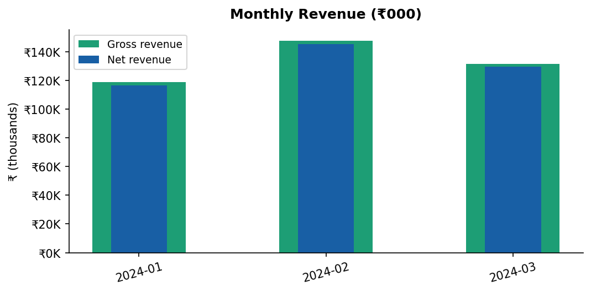
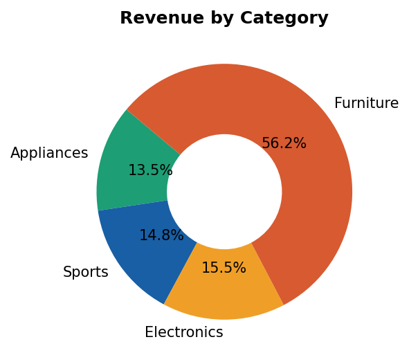
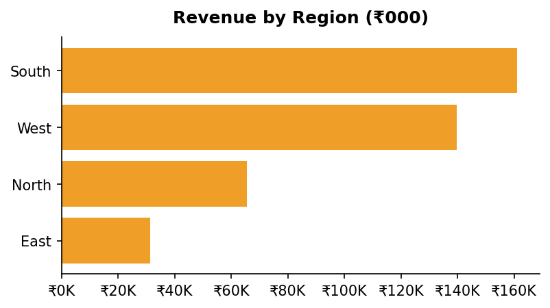
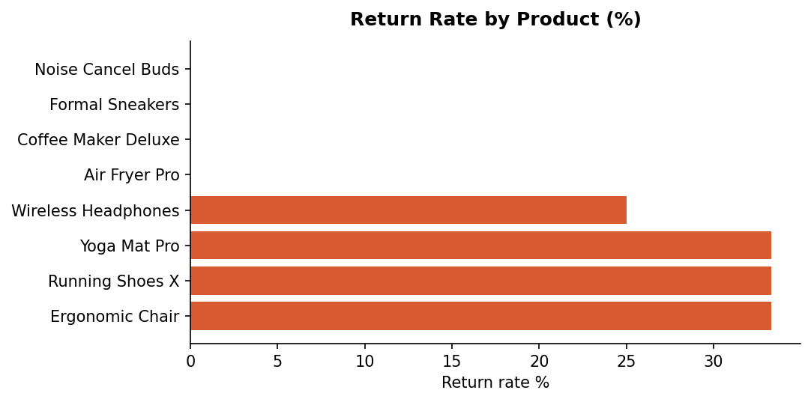
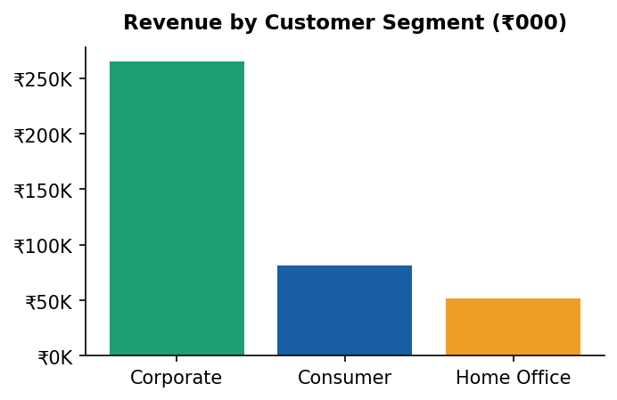

# E-Commerce Ops Dashboard

**Replaced 3 duplicate manual trackers with one unified pipeline.**

| Old tracker | Format | Replaced by |
|-------------|--------|-------------|
| Revenue & Sales tracker | Excel (manual formulas) | SQL Query 1, 2, 7 |
| Returns & Quality log | Google Sheet (manual entries) | SQL Query 6 |
| Regional sales summary | CSV (manually compiled) | SQL Query 4 |

**Result:** `python dashboard.py` — all three trackers' worth of data, plus 5 charts and a stakeholder report with SOP, in one run.

---

## Outputs

### Charts (auto-generated)

| Monthly Revenue | Revenue by Category |
|---|---|
|  |  |

| By Region | Return Rates | By Segment |
|---|---|---|
|  |  |  |

### Full report
See [`outputs/dashboard_report.md`](outputs/dashboard_report.md) — includes KPIs, trend tables, return analysis, and a built-in SOP for non-technical users.

---

## How it works

```
data/orders.csv
      ↓
  Load into SQLite (no server needed)
      ↓
  7 SQL queries → KPIs, trends, returns, regional, segment breakdown
      ↓
  5 Matplotlib charts (PNG)
      ↓
outputs/dashboard_report.md  ← stakeholder report with SOP
outputs/data/*.csv           ← clean exports for each query
outputs/charts/*.png         ← charts for Notion / slide decks
```

---

## Setup

```bash
git clone https://github.com/tanishaa11/ecommerce-ops-dashboard
cd ecommerce-ops-dashboard
pip install -r requirements.txt
python dashboard.py
```

Custom data:
```bash
python dashboard.py --input path/to/your_orders.csv
```

---

## SQL queries (portable)

All KPI logic lives in [`sql/queries.sql`](sql/queries.sql) — standard ANSI SQL, runs in SQLite, PostgreSQL, or MySQL unchanged. Open in DBeaver, TablePlus, or any SQL client.

7 queries included:
- Overall KPIs · Monthly trend · Category breakdown · Regional breakdown
- Customer segment performance · Return analysis · Top 10 products by net revenue

---

## Stack

`Python` `SQLite` `SQL` `Pandas` `Matplotlib`

---

**Related project:** [GenAI Reporting Pipeline](https://github.com/tanishaa11/genai-reporting-pipeline) — automated sales reporting with Gemini AI + Zapier trigger
